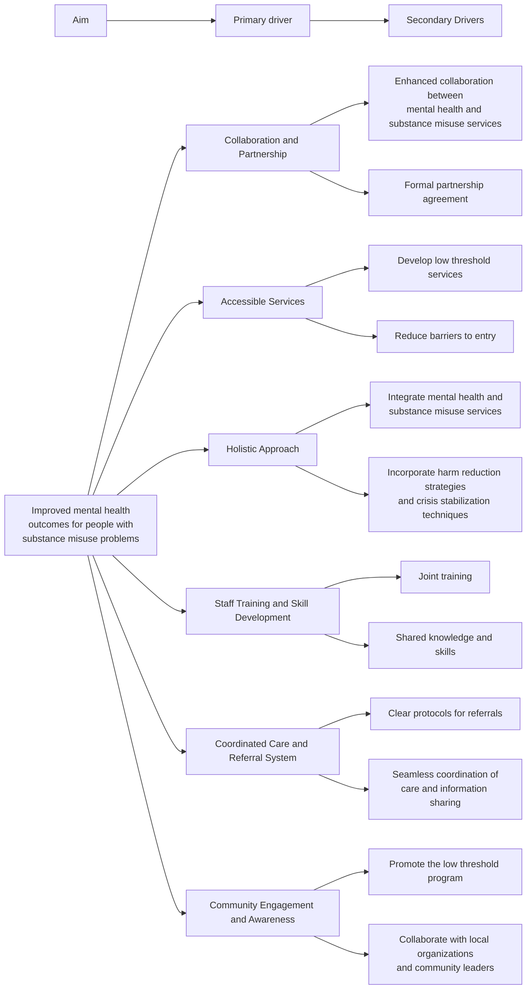

## Develop a low threshold substance misuse program for people in crisis

Measurement_and_Monitoring[Measurement and Monitoring]
Measurement_and_Monitoring --> Number_of_Individuals[Number of individuals accessing the program]
Measurement_and_Monitoring --> Reduction_in_Crises[Reduction in substance misuse-related crises]
Measurement_and_Monitoring --> Improvement_in_Outcomes[Improvement in mental health outcomes]
Measurement_and_Monitoring --> Client_Satisfaction[Client satisfaction and feedback]