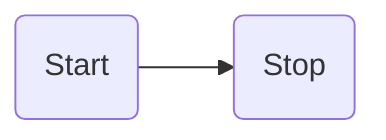
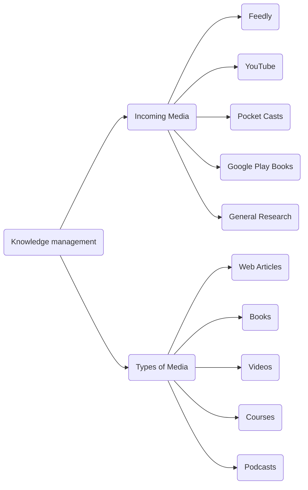

## Examples

```mermaid
flowchart LR
id1(Start)
id2(Stop)
id1 --> id2
```

```mermaid
flowchart LR

id(Knowledge management)

id1(Incoming Media)
id2(Types of Media)

%% Media Sources
id1.1(Feedly)
id1.2(YouTube)
id1.3(Pocket Casts)
id1.4(Google Play Books)
id1.5(General Research)

%% Types Of Media
id2.1(Web Articles)
id2.2(Books)
id2.3(Videos)
id2.4(Courses)
id2.5(Podcasts)

id --> id1 & id2
id1 --> id1.1 & id1.2 & id1.3 & id1.4 & id1.5
id2 --> id2.1 & id2.2 & id2.3 & id2.4 & id2.5
```

- from https://heymichellemac.com/knowledge-management-flow-diagram-in-obsidian
- export via copy and paste into https://mermaid.live

