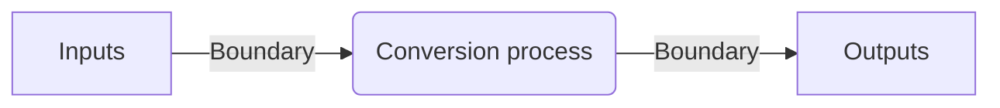

[[Tavistock Model]]

- the physical layout of the team and the lines of communication
- The system needs to be semipermeable
- If it is impermeable the system dies
- If it is over-permeable the system dissolves into chaos

- Management of the boundaries is the task of the manager