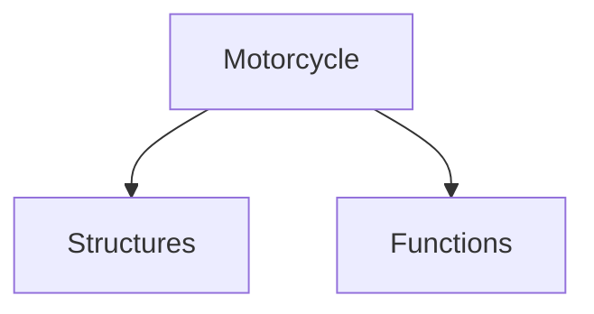

[[Robert Pirsig - Zen and the art of motorcycle maintenance]]
[[zen and the art - chap 7]]

- Precision instruments - beauty based on underlying form
- [[Systems]] are [[structures]] with relations

- the system is not the problem: It’s the underlying [[thought]] that creates it
- Bozeman, [[Montana]]
- A motorcycle is a creation of [[thought]], not steel. That’s what’s the meaning of it’s all thought is. 
- A far right environment is the ideal environment for a real [[radical]]. 

[[zen and the art - chap 9]]