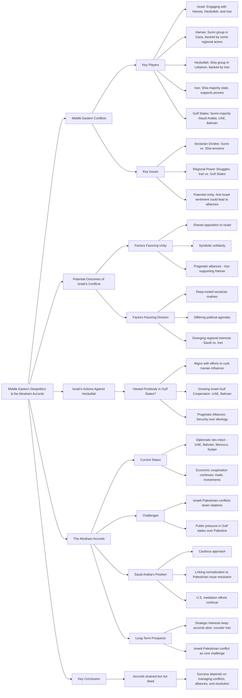

[[Gaza war]]
[[Israel]]
[[Mermaid]]

```mermaid
graph LR
    A[Middle Eastern Geopolitics & the Abraham Accords]

    A --> B[Middle Eastern Conflicts]
    A --> C[Potential Outcomes of Israel's Conflicts]
    A --> D[Israel's Actions Against Hezbollah]
    A --> E[The Abraham Accords]
    A --> F[Key Conclusion]

    B --> B1[Key Players]
    B --> B2[Key Issues]

    B1 --> B1_1[Israel: Engaging with Hamas, Hezbollah, and Iran]
    B1 --> B1_2[Hamas: Sunni group in Gaza, backed by some regional actors]
    B1 --> B1_3[Hezbollah: Shia group in Lebanon, backed by Iran]
    B1 --> B1_4[Iran: Shia-majority state, supports proxies]
    B1 --> B1_5[Gulf States: Sunni-majority -Saudi Arabia, UAE, Bahrain]

    B2 --> B2_1[Sectarian Divides: Sunni vs. Shia tensions]
    B2 --> B2_2[Regional Power Struggles: Iran vs. Gulf States]
    B2 --> B2_3[Potential Unity: Anti-Israel sentiment could lead to alliances]

    C --> C1[Factors Favoring Unity]
    C --> C2[Factors Favoring Division]

    C1 --> C1_1[Shared opposition to Israel]
    C1 --> C1_2[Symbolic solidarity]
    C1 --> C1_3[Pragmatic alliances - Iran supporting Hamas]

    C2 --> C2_1[Deep-rooted sectarian rivalries]
    C2 --> C2_2[Differing political agendas]
    C2 --> C2_3[Diverging regional interests - Saudi vs. Iran]

    D --> D1[Viewed Positively in Gulf States?]
    D1 --> D1_1[Aligns with efforts to curb Iranian influence]
    D1 --> D1_2[Growing Israel-Gulf Cooperation -UAE, Bahrain]
    D1 --> D1_3[Pragmatic Alliances: Security over ideology]

    E --> E1[Current Status]
    E --> E2[Challenges]
    E --> E3[Saudi Arabia's Position]
    E --> E4[Long-Term Prospects]

    E1 --> E1_1[Diplomatic ties intact - UAE, Bahrain, Morocco, Sudan]
    E1 --> E1_2[Economic cooperation continues -trade, investments]

    E2 --> E2_1[Israeli-Palestinian conflicts strain relations]
    E2 --> E2_2[Public pressure in Gulf states over Palestine]

    E3 --> E3_1[Cautious approach]
    E3 --> E3_2[Linking normalization to Palestinian issue resolution]
    E3 --> E3_3[U.S. mediation efforts continue]

    E4 --> E4_1[Strategic interests keep accords alive -counter Iran]
    E4 --> E4_2[Israeli-Palestinian conflict as core challenge]

    F --> F1[Accords strained but not dead]
    F1 --> F2[Success depends on managing conflicts, alliances, and resolution]
```
